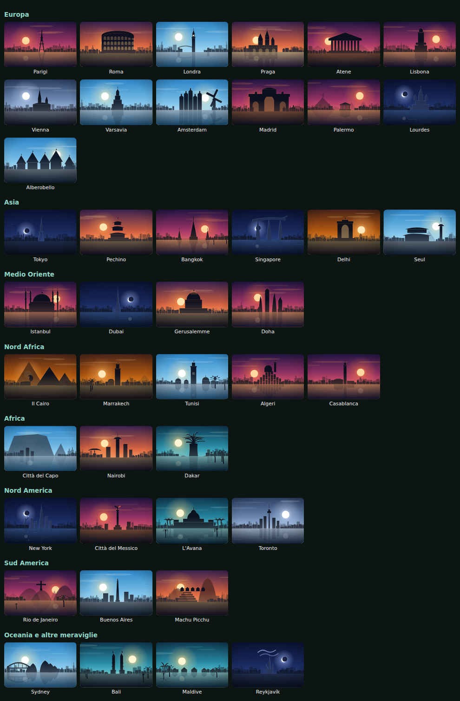

# Le immagini delle città

Nel sito ogni città ha la sua immagine. Ci sono due strade e funzionano insieme.

## 1. I disegni (già pronti, nessun problema di diritti)

In `immagini/citta/` ci sono **42 illustrazioni** fatte da noi, una per città:
Parigi, Roma, Londra, Praga, Atene, Lisbona, Vienna, Varsavia, Amsterdam, Madrid,
Palermo, Lourdes, Alberobello, Tokyo, Pechino, Bangkok, Singapore, Delhi, Seul,
Istanbul, Dubai, Gerusalemme, Doha, Il Cairo, Marrakech, Tunisi, Algeri, Casablanca,
Città del Capo, Nairobi, Dakar, New York, Città del Messico, L'Avana, Toronto,
Rio de Janeiro, Buenos Aires, Machu Picchu, Sydney, Bali, Maldive, Reykjavík.

Sono file **SVG**: pesano pochi KB, restano nitidi su qualsiasi schermo, non
si scaricano da nessuna parte e **non hanno diritti d'autore da pagare**.
Nessuno ti può mandare una lettera dell'avvocato.

Si rifanno tutti con:

    node crea-immagini.mjs

I disegni si compongono da soli: cielo, sole o luna, acqua con il riflesso,
i profili delle case e **il monumento che fa riconoscere la città**
(la Torre Eiffel, il Colosseo, il Partenone, le piramidi, il Cristo di Rio…).
Il pezzo che disegna sta in `motore.mjs`, i monumenti in `citta-europa.mjs`
e `citta-mondo.mjs`, l'elenco delle città in `citta.mjs`.

## 2. Le foto vere (se le vuoi)

Basta mettere un file in `immagini/foto/` con il nome della città:

    immagini/foto/parigi.jpg
    immagini/foto/roma.jpg

Vanno bene `.jpg` `.png` `.webp` `.avif`. Da quel momento **il sito usa la foto**
e il disegno resta lì sotto come rete di sicurezza: se cancelli la foto,
torna il disegno e non si rompe niente.

Dopo aver messo le foto, rifai il sito:

    node costruisci.mjs

### Scaricarle in automatico

    node scarica-foto.mjs                 tutte quelle che mancano
    node scarica-foto.mjs parigi roma     solo queste
    node scarica-foto.mjs --rifai         riscarica anche quelle che ci sono
    node scarica-foto.mjs --elenco        dice solo cosa farebbe

Le prende da **Wikimedia Commons**, che accetta solo immagini libere,
utilizzabili anche per lavoro. Scrive da solo l'elenco di chi le ha scattate
in `immagini/foto/crediti.txt`: **quell'elenco va messo sul sito**
(in fondo alla pagina o dentro la pagina Privacy), perché quasi tutte le
licenze libere chiedono il nome dell'autore.

Se il computer è dietro a un firewall aziendale lo script lo dice e si ferma
senza combinare guai: le foto non arrivano, il sito continua a usare i disegni.

### Se preferisci sceglierle a mano

Siti dove le foto sono gratis anche per uso commerciale, senza chiedere permesso:

| Sito | Indirizzo | Cosa chiede |
|---|---|---|
| Unsplash | unsplash.com | niente (citare l'autore è cortesia) |
| Pexels | pexels.com | niente |
| Pixabay | pixabay.com | niente |
| Wikimedia Commons | commons.wikimedia.org | quasi sempre il nome dell'autore |
| openverse | openverse.org | dipende dalla licenza, la scrive lei |

**Attenzione a tre cose:**

1. Non prendere foto da Google Immagini: lì dentro c'è di tutto, anche roba
   protetta. È il modo più veloce per prendersi una multa.
2. Se nella foto si riconoscono delle persone in primo piano, per la pubblicità
   serve la loro liberatoria. Meglio panorami e monumenti.
3. Ridimensiona a **1600 px di larghezza** prima di metterla: una foto da 6 MB
   fa aprire il sito in cinque secondi, e il cliente se ne va.

## Come sono legate ai viaggi

In `contenuti/comune.mjs` ogni viaggio ha il campo `citta`, che dice quale
immagine usare:

    sicilia → palermo      marocco → marrakech    praga → praga
    lourdes → lourdes      grecia  → atene        puglia → alberobello

Se aggiungi un viaggio nuovo, metti lì il nome di una delle 42 città
(oppure aggiungi la città in `immagini/citta.mjs` e ridisegna).

---

